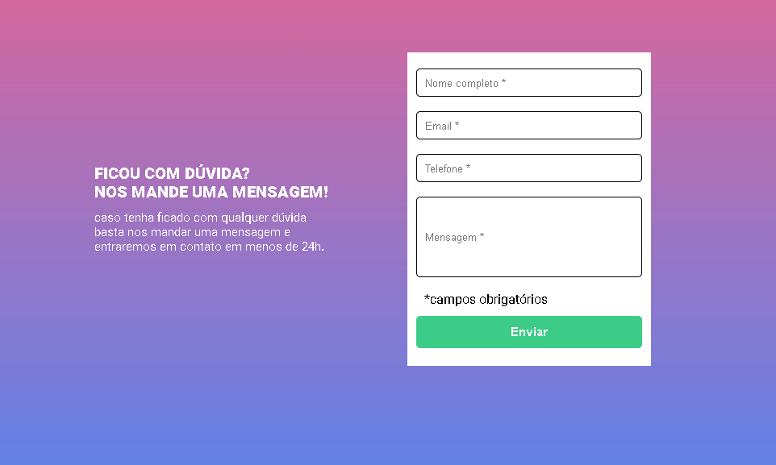
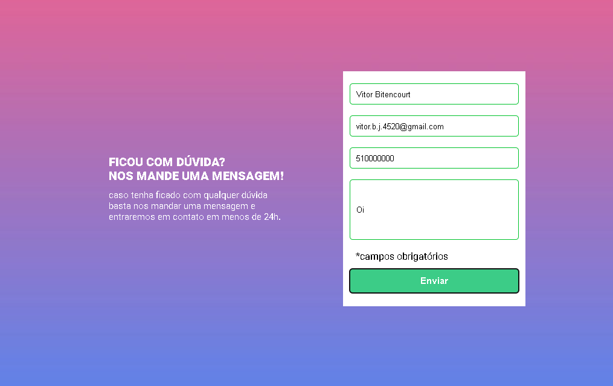

# Desafio - formulário com validação

## Um desafio do Dev Quest, cujo objetivo é fazer um fomulário com validação. 

Ao clicar para enviar o formulário, se caso
algum campo não estiver preenchido, a borda
do input deve ficar vermelha e uma mensagem
de "campo obrigatório" deve aparecer embaixo
do campo que não foi preenchido.

## Tecnologias utilizadas
-HTML     
-CSS   
-JAVASCRIPT  

## Assim fica o formulário em branco:

## Assim fica ele preenchido

## E assim ele não preenchido

